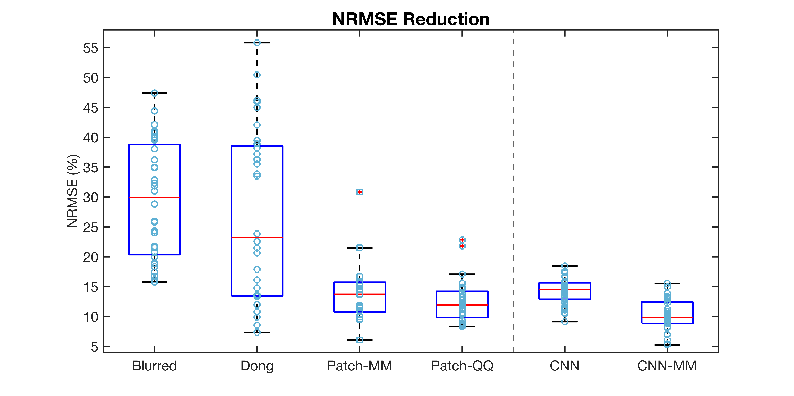
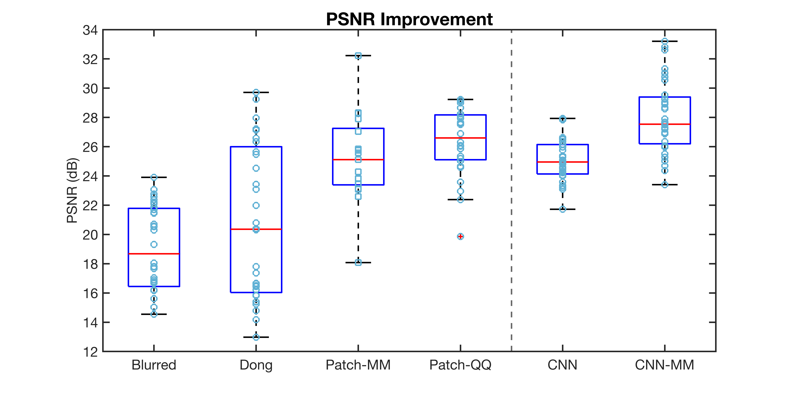

# EECS 556 Project Repository
This is a private GitHub repository for EECS 556 Image Processing Project
    "Algorithms for Blind Image Deblurring" by Wei Hu, Zongyu Li, Preston Pan, Nisarg Trivedi.

## Abstract:
Blind image deblurring aims to restore a blurred image without knowledge of the blurring kernel. This report discusses three algorithms based on alternating minimization routines of a maximum a posteriori (MAP) model. We first re-implement the method proposed by Dong et al., where an iteratively re-weighted least squares algorithm (IRLS) was used to optimize the proposed novel data-fidelity function with hyper-Laplacian image prior and vector 1-norm as kernel prior. However, because IRLS suffers drawbacks of division by zeros and is sensitive to initialization, we investigated the majorize-minimize algorithm (MM) with Huber's majorizer and applied proximal gradient methods for optimization. Additionally, we implemented an image gradient-based method for latent image estimation, as suggested by Prof. Qing Qu. Furthermore, to potentially improve the deblurred results, we tried to initialize our algorithms
with images estimated by a blind deep learning method (Ren et al.) which out-performed all other methods and initialization schemes. All algorithms discussed in this report were tested on a well-known dataset (consisting of 4 real images and 8 blurring kernels) and evaluated by Normalized Root Mean Square Error (NRMSE) and Peak Signal to Noise Ratio (PSNR). With a comprehensive comparison and analysis, we concluded that our deblurring algorithms meet the expectations of quantitative performance prediction (QPP) stated in our proposal.

This repository contains Julia and MATLAB code used to produce results reported in the paper. Dataset is stored in a Google Drive folder and is available upon request.

## Julia Instructions:
To make sure you have all packages and files, please run 'include_all.jl' first.

## Some Results:
<embed src = "fig/levin_test_re.pdf" type = "application/pdf">

## Comparison:

## Key References:
J. Dong, J. Pan, Z. Su, and M. Yang. “Blind Image Deblurring with Outlier Handling”. In: 2017
IEEE International Conference on Computer Vision (ICCV). 2017, pp. 2497–2505. DOI: 10.1109/
ICCV.2017.271.

Dongwei Ren, K. Zhang, Qilong Wang, Q. Hu, and W. Zuo. “Neural Blind Deconvolution Using
Deep Priors”. In: 2020 IEEE/CVF Conference on Computer Vision and Pattern Recognition (CVPR)
(2020), pp. 3338–3347.

## Dataset:
A. Levin, Y. Weiss, F. Durand, and W. T. Freeman. “Understanding and evaluating blind deconvolution algorithms”. In: 2009 IEEE Conference on Computer Vision and Pattern Recognition. 2009,
pp. 1964–1971. DOI: 10.1109/CVPR.2009.5206815
